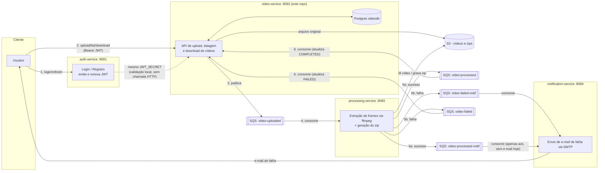
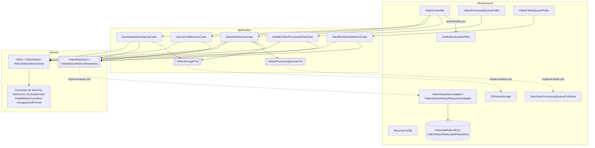
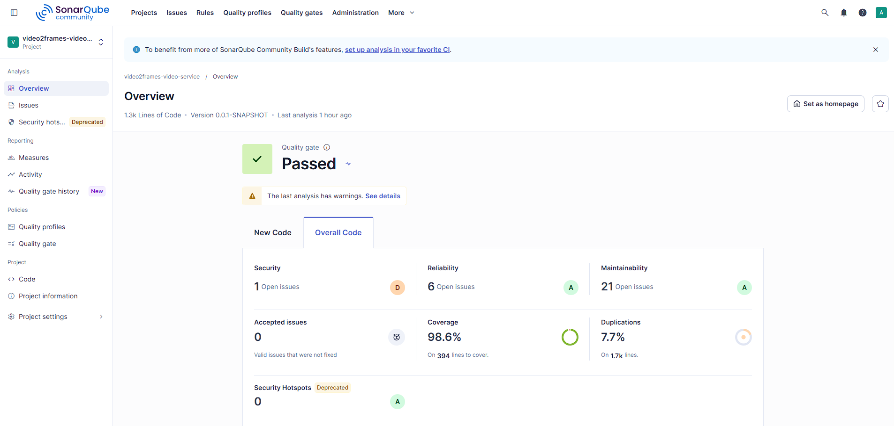

# video2frames-video-service

Projeto Pós-Tech Fase 05 - Microserviço para gerenciamento dos vídeos/retornos e controle de status

## Visão geral

O `video2frames-video-service` é o serviço de borda do sistema **Video2Frames**. É ele quem recebe o upload dos vídeos, guarda o arquivo original, controla o ciclo de vida (status) de cada vídeo e disponibiliza o resultado final (zip de frames) para download. Ele não processa vídeo nenhum: quem extrai os frames via `ffmpeg` é o `processing-service`. Este serviço só orquestra o fluxo via fila (SQS) e persiste o estado em Postgres.

Principais responsabilidades:

- Expor uma API REST autenticada por JWT para upload, listagem e download de vídeos.
- Persistir metadados e histórico de status de cada vídeo (Postgres + Flyway).
- Enviar o arquivo de vídeo original para o S3.
- Publicar um evento na fila `video-uploaded` para o `processing-service` consumir.
- Consumir as filas `video-processed` e `video-failed` para atualizar o status do vídeo conforme o resultado do processamento.

O serviço é construído em arquitetura hexagonal (portas e adaptadores), separando `domain` (regras de negócio puras), `application` (casos de uso, orquestração) e `infrastructure` (web, persistência, mensageria, segurança, storage).

## O papel deste serviço no pipeline Video2Frames

O Video2Frames é composto por quatro microserviços independentes, cada um em seu próprio repositório. Eles se comunicam por HTTP (autenticação) e filas SQS (pipeline assíncrono de processamento):



Este repositório (`video-service`) valida o JWT localmente (assinatura HS256 com o mesmo segredo do `auth-service`). Ele não faz nenhuma chamada HTTP ao `auth-service` em tempo de requisição.

## Arquitetura interna (hexagonal)



Fluxos principais:

- **Upload** (`UploadVideoUseCase`): valida o `content-type`, persiste o vídeo com status `UPLOADED`, envia o arquivo para o S3, publica o evento na fila `video-uploaded` e marca o vídeo como `PROCESSING`. Cada etapa é persistida separadamente, então se algo falhar no meio do caminho o banco reflete exatamente até onde o fluxo chegou.
- **Atualização de status via fila**: `VideoProcessedQueuePoller`/`VideoFailedQueuePoller` fazem long-polling nas filas SQS e delegam para `HandleVideoProcessedUseCase`/`HandleVideoFailedUseCase`, que atualizam o status do vídeo (`COMPLETED`/`FAILED`) e gravam uma entrada no histórico de status.
- **Listagem** (`ListUserVideosUseCase`): retorna os vídeos do usuário autenticado, mais recentes primeiro.
- **Download** (`DownloadVideoZipUseCase`): valida posse do vídeo e se o status permite download (`COMPLETED` com zip disponível) antes de buscar o arquivo no S3.

## Endpoints

Todos os endpoints abaixo exigem um header `Authorization: Bearer <jwt>` com um token emitido pelo `auth-service` (mesmo `JWT_SECRET` configurado nos dois serviços). O e-mail do usuário autenticado (subject do JWT) é usado para filtrar/autorizar o acesso aos vídeos e nunca é aceito como parâmetro do cliente.

| Método | Caminho                     | Descrição                                                                 |
|--------|------------------------------|----------------------------------------------------------------------------|
| POST   | `/api/videos`                | Upload de um vídeo (`multipart/form-data`, campo `file`). Retorna o vídeo criado (status `PROCESSING`). |
| GET    | `/api/videos`                | Lista os vídeos do usuário autenticado, mais recentes primeiro.           |
| GET    | `/api/videos/{id}/download`  | Faz o download do zip de frames de um vídeo `COMPLETED` pertencente ao usuário. |

Além disso, `/actuator/**` é exposto publicamente (sem JWT) para health checks e métricas. Ver seção [Monitoramento](#monitoramento--observabilidade).

## Filas consumidas e publicadas

| Fila                  | Direção   | Variável de ambiente           | Uso |
|------------------------|-----------|----------------------------------|-----|
| `video-uploaded`       | Publica   | `SQS_VIDEO_UPLOADED_QUEUE`       | Publicado após o upload ser persistido e o arquivo salvo no S3, para o `processing-service` iniciar a extração de frames. |
| `video-processed`      | Consome   | `SQS_VIDEO_PROCESSED_QUEUE`      | Consumido para marcar o vídeo como `COMPLETED` e registrar a key do zip e a quantidade de frames. |
| `video-failed`         | Consome   | `SQS_VIDEO_FAILED_QUEUE`         | Consumido para marcar o vídeo como `FAILED` e registrar o motivo da falha. |

Os pollers (`VideoProcessedQueuePoller`/`VideoFailedQueuePoller`) usam long-polling manual (não `@SqsListener`) e só deletam a mensagem da fila depois que o processamento tem sucesso. Em caso de erro, a mensagem volta a ficar visível após o "visibility timeout" e é reprocessada. Depois de 3 tentativas sem sucesso, o próprio SQS move a mensagem para a DLQ correspondente (`<fila>-dlq`, provisionada em `video2frames-infra-ops`). Mais detalhes na [documentação de arquitetura](../video2frames-infra-ops/docs/arquitetura.md#resiliência-das-filas-dead-letter-queue-dlq).

## Cache

A listagem de vídeos por usuário (`GET /api/videos`) é cacheada no Redis (`userVideos::<email>`, TTL de 5 minutos) e invalidada explicitamente sempre que o status de algum vídeo daquele usuário muda (upload, sucesso, falha). Detalhes em `CacheConfig` e na seção de cache do [documento de arquitetura](../video2frames-infra-ops/docs/arquitetura.md#cache) (inclusive o motivo de usar JDK serialization em vez de JSON).

## Stack técnica

- Java 17
- Spring Boot 4.1 (Web, Security, Data JPA, Validation, Actuator, Cache)
- PostgreSQL + Flyway (migrations versionadas)
- Redis (cache da listagem de vídeos por usuário)
- JJWT, validação local de JWT (HS256)
- AWS SDK v2, S3 (armazenamento de vídeos/zips) e SQS (mensageria assíncrona)
- Lombok
- Micrometer + Prometheus registry (métricas)
- JUnit 5, Mockito, AssertJ (testes)

## Como rodar localmente

Pré-requisito: Docker.

O LocalStack (S3 + SQS) usado por este serviço é compartilhado com `processing-service` e `notification-service`. Ele mora no repositório irmão `video2frames-infra-ops`, que precisa subir primeiro:

```bash
cd ../video2frames-infra-ops
docker compose up -d
```

Depois, neste repositório:

```bash
docker compose up -d
```

Isso sobe três containers interligados:

- `videodb` — Postgres na porta `5433` (host) / `5432` (interno).
- `redis` — cache na porta `6379`.
- `video-service` — a própria aplicação, na porta `8082`, conectada ao `videodb`, ao `redis` e ao LocalStack compartilhado (`video2frames-localstack:4566`, via a rede Docker externa `video2frames-net`).

Depois de subir, a API fica disponível em `http://localhost:8082/api/videos` e o health check em `http://localhost:8082/actuator/health`.

> Se aparecer o erro `network video2frames-net declared as external, but could not be found`, é porque o `video2frames-infra-ops` ainda não foi iniciado. Suba-o primeiro.

## Variáveis de ambiente

| Variável                       | Padrão (dev)                                              | Descrição |
|---------------------------------|-------------------------------------------------------------|-----------|
| `DB_URL`                        | `jdbc:postgresql://localhost:5433/videodb`                   | URL JDBC do Postgres. |
| `DB_USER`                       | `videodb`                                                    | Usuário do banco. |
| `DB_PASSWORD`                   | `videodb`                                                    | Senha do banco. |
| `REDIS_HOST`                    | `localhost`                                                  | Host do Redis usado para cache da listagem de vídeos. |
| `REDIS_PORT`                    | `6379`                                                       | Porta do Redis. |
| `SERVER_PORT`                   | `8082`                                                       | Porta HTTP do serviço. |
| `JWT_SECRET`                    | valor de desenvolvimento embutido                            | Segredo HS256 usado para validar o JWT. Precisa ser idêntico ao configurado no `auth-service`. |
| `AWS_REGION`                    | `us-east-1`                                                  | Região AWS usada pelos clients S3/SQS. |
| `AWS_ENDPOINT_OVERRIDE`         | `http://localhost:4566`                                      | Endpoint customizado (LocalStack em dev; remover/ajustar em produção). |
| `AWS_ACCESS_KEY_ID`             | `test`                                                       | Access key AWS (ou dummy do LocalStack). |
| `AWS_SECRET_ACCESS_KEY`         | `test`                                                       | Secret key AWS (ou dummy do LocalStack). |
| `S3_BUCKET`                     | `video2frames`                                               | Bucket usado para vídeos originais e zips de frames. |
| `SQS_VIDEO_UPLOADED_QUEUE`      | `video-uploaded`                                             | Nome da fila publicada após o upload. |
| `SQS_VIDEO_PROCESSED_QUEUE`     | `video-processed`                                            | Nome da fila consumida em caso de sucesso do processamento. |
| `SQS_VIDEO_FAILED_QUEUE`        | `video-failed`                                               | Nome da fila consumida em caso de falha do processamento. |
| `LOG_LEVEL`                     | `INFO`                                                       | Nível de log do pacote `br.com.video2frames`. |
| `LOG_LEVEL_ROOT`                | `INFO`                                                       | Nível de log raiz (bibliotecas/frameworks). |
| `LOG_FORMAT`                    | vazio (texto plano no console)                               | Definir como `ecs` ativa logging estruturado em JSON (ver seção [Logging](#logging)). |

## Testes

O projeto tem 85 testes unitários (JUnit 5 + Mockito + AssertJ, com nomenclatura em português no padrão `metodo_quandoX_resultado`), cobrindo domínio, casos de uso, adapters de persistência/mensageria/storage, segurança e o controller web.

```bash
./mvnw test
```

Cobertura atual (medida via JaCoCo, ver seção de [SonarQube](#qualidade-de-código-sonarqube)): **98.6%**. O relatório é gerado em `target/site/jacoco/jacoco.xml` a cada execução de `test`.

## Logging

O serviço usa SLF4J (via Lombok `@Slf4j`) com o logging estruturado nativo do Spring Boot 4, sem nenhuma dependência extra. O comportamento é controlado pela variável `LOG_FORMAT`:

- **Em desenvolvimento** (`LOG_FORMAT` vazio): logs em texto plano legível no console.
- **Em staging/produção** (`LOG_FORMAT=ecs`): logs em JSON no formato [ECS (Elastic Common Schema)](https://www.elastic.co/guide/en/ecs/current/index.html), prontos para serem coletados por CloudWatch Logs, ELK/Elasticsearch ou qualquer agregador que entenda JSON, sem precisar trocar nenhuma linha de código.

Eventos de negócio relevantes (upload concluído, mudança de status de um vídeo, download iniciado) são logados em `INFO`. Falhas esperadas de domínio (vídeo não encontrado, acesso negado, formato não suportado, transição de estado inválida, JWT inválido) são logadas em `WARN`, sem nunca logar o conteúdo de arquivos, tokens JWT ou segredos.

## Monitoramento / Observabilidade

O Spring Boot Actuator expõe, sem autenticação, em `/actuator/**`:

- `GET /actuator/health` — liveness/readiness do serviço (inclui checks de banco de dados).
- `GET /actuator/prometheus` — métricas no formato Prometheus (via Micrometer), incluindo métricas HTTP, JVM, pool de conexões, etc.
- `GET /actuator/info` / `GET /actuator/metrics` — informações gerais e métricas detalhadas.

Para visualizar essas métricas em dashboards, use o stack compartilhado do repositório `video2frames-infra-ops` (Prometheus + Grafana). Ele faz scrape de `/actuator/prometheus` dos quatro microserviços do Video2Frames (via `host.docker.internal`) e já vem com um dashboard pré-provisionado, "Video2Frames - Overview".

## Qualidade de código (SonarQube)

Uma análise local do SonarQube foi executada sobre esta base de código, com Quality Gate: Passed.

| Métrica              | Valor |
|----------------------|-------|
| Linhas de código      | 1314 |
| Cobertura              | 98.6% |
| Bugs                   | 0 (Reliability rating A) |
| Vulnerabilidades       | 1 (Security rating D) |
| Code Smells            | 21 (Maintainability rating A) |
| Linhas duplicadas      | 7.7% |



Para reproduzir a análise localmente (requer um SonarQube rodando em `http://localhost:9000` e um token de projeto):

```bash
./mvnw test org.sonarsource.scanner.maven:sonar-maven-plugin:sonar -Dsonar.projectKey=video2frames-video-service -Dsonar.host.url=http://localhost:9000 -Dsonar.token=<seu-token> -Dsonar.coverage.jacoco.xmlReportPaths=target/site/jacoco/jacoco.xml
```
